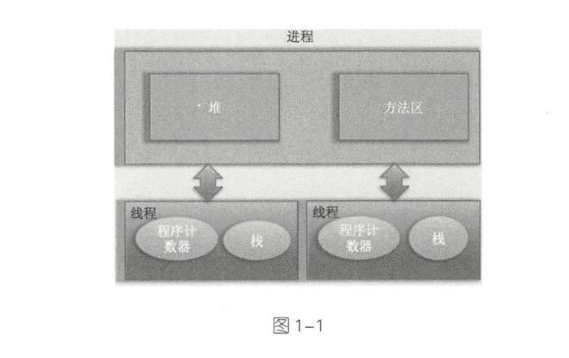

### Thread

- 进程与线程之间的关系

  

  - 线程私有
    - 程序计数器：用来记录线程当前要执行的指令地址 ，CPU是通过时间片轮转方式进行执行 ，所以要知道当前线程执行到哪里了
    - 栈：用于存储线程的局部变量，也存放线程的调用堆栈
  - 堆：进程中的内存，所有线程共享
  - 方法区：JVM加载过的类、常量、静态变量等信息，也是线程共享的

- 线程的创建方式

  - Runnable实现run()方法
  - 继承Thread并重写run()方法
  - 实现Callable<T> Callable有返回值，可用FutureTask 封装
  - 实现接口 VS 继承 Thread
    - Java 不支持多重继承，因此继承了 Thread 类就无法继承其它类，但是可以实现多个接口
    - 类可能只要求可执行就行，继承整个 Thread 类开销过大。

- 线程中断

  - 一个线程执行完毕之后会自动结束，如果在运行过程中发生异常也会提前结束。
  - 通过调用一个线程的 interrupt() 来中断该线程，如果该线程处于阻塞、限期等待或者无限期等待状态，那么就会抛出 InterruptedException，从而提前结束该线程。但是不能中断 I/O 阻塞和 synchronized 锁阻塞。
  - Executor 的中断操作
    - 调用 Executor 的 shutdown() 方法会等待线程都执行完毕之后再关闭，但是如果调用的是 shutdownNow() 方法，则相当于调用每个线程的 interrupt() 方法。

- 线程的状态

  

  - New（新创建）
    - 未运行，只是new Thread(r)
  - Runnable（可运行）
    - 调用start()，可能运行，也可能没运行
  - Blocked（被阻塞）getLock()
  - Waiting（等待）Object.wait()
  - Time waiting（计时等待）sleep(1000)
  - Terminated（被终止）join()

- 线程优先级  setPriority(int newPriority) 方法设置，优先级不保证一定按照级别执行

  - Thread.MIN_PRIORITY  
  - Thread.MAX_PRIORITY  

- 守护线程 t.setDaemon(true) ，为其他线程提供服务

- 线程操作原子性

  - 可以并发包下的原子类

- 可见性（volatile 关键字）

- 监视器（synchronized 关键字，由JVM层面实现）

  - ReentrantLock是Java层面实现的

- ThreadLocal（线程的私有变量）

  - 如SimpleDateFormat 类不是线程安全的，当多个线程访问时，数据将会混乱，可以使用

    ```java
    public static final ThreadLocal<SimpleDateFormat> dateFormat =
    ThreadLocal.withInitial(() -> new SimpleDateFormat("yyyy-MM-dd"));
    // 获取当前线程的 SimpleDateFormat 对象
    String dateStamp = dateFormat.get().format(new DateO);
    ```

- 锁测试

  - tryLock() 会返回一个bool，会抢占可用的锁即使是公平策略

- 读写锁

  - ReentrantLock  
  - ReentrantReadWriteLock  读多写少

- 阻塞队列

  - LinkedBlockingQueue  
  - LinkedBlockingDeque  双端队列
  - ArrayBlockingQueue  可设置公平性
  - PriorityBlockingQueue  优先级队列

- 线程安全集合

  - ConcurrentHashMap  
  - ConcurrentSkipListMap  
  - ConcurrentSkipListSet  
  - ConcurrentLinkedQueue  

- Callable 与 Runnable  类是，有返回值，有泛型

- Future  是异步计算，会交由一个线程执行

- 执行器 （ Executor)  

  - newCachedThreadPool 必要时创建新线程；空闲线程会被保留 60 秒
  - newFixedThreadPool 该池包含固定数量的线程；空闲线程会一直被保留
  - fork-join  框架，分解

  

